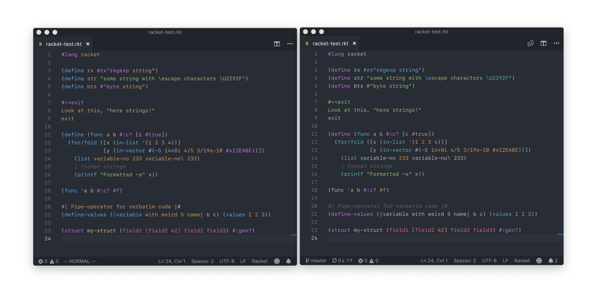
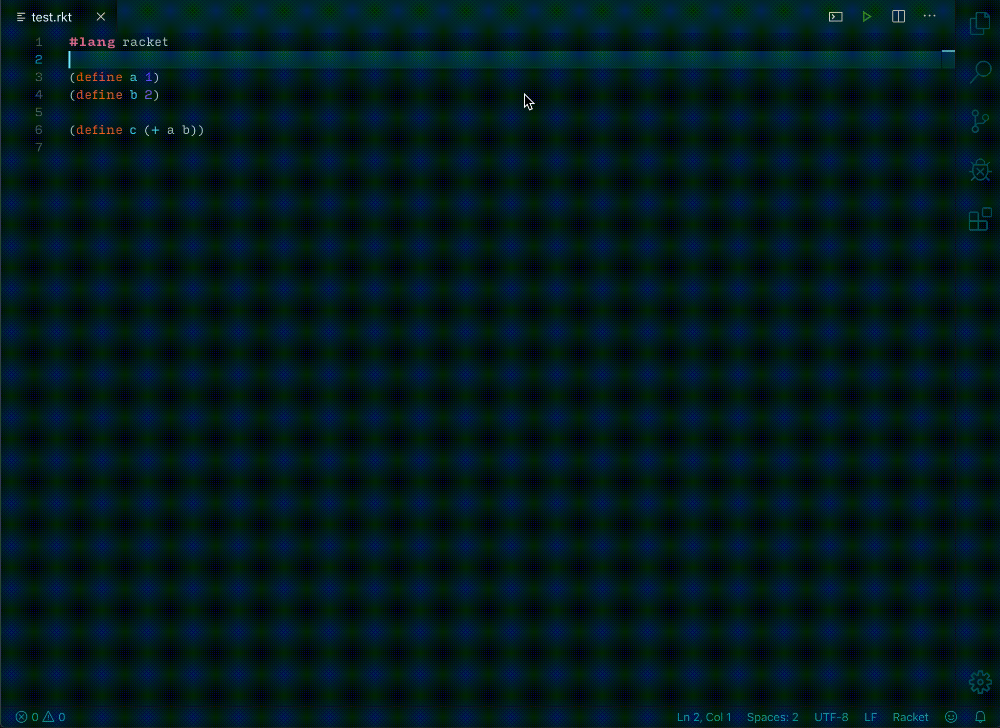

# Magic Racket for VS Code

This extension adds support for [Racket](http://www.racket-lang.org) syntax highlighting and REPL.

## Features

Magic Racket aims to:

- Have nearly complete support for every valid Racket syntax. Byte strings, regexps, define clauses, vectors... You name it, we have it.
- Support highlighting of all of the functions in `#lang racket`.

...but at the same time it doesn't want to:

- Get in your way (by providing useless snippets, or throwing around colorization just for the sake of it).
- Only work in VS Code. The code is highly portable and there are plans to port Magic Racket also to Atom and Sublime Text.

Eventually, I'd like to be able to include support for Racket LSP as well; in the meantime, you can at least use the REPL quite comfortably by leveraging the Magic Racket REPL integration.

### Syntax highlighting

The image shows a comparison of a testing file highlighted using a popular Racket VS Code extension (on the left) and by Magic Racket (on the right).

As you can see, the highlighting strives to be _correct_ and _consistent_ — and it supports most of the language features as well. In many ways, this extension was inspired by the highlighting in DrRacket, however, in some aspects it aims to be less minimalistic.

### REPL support

There are five new commands in VS Code, and you can find them upon pressing <kbd>`Cmd+Shift+P`</kbd> (or <kbd>`Ctrl+Shift+P`</kbd> if you're on Linux or Windows):

- `Racket: Execute selection in REPL`
  - Executes the selection(s) in the REPL. Available also by right-clicking the selection or by using the shortcut <kbd>Alt+Enter</kbd>.
- `Racket: Launch a new REPL`
  - Launches a new, blank REPL (and doesn't load any file into it).
- `Racket: Load file into the current REPL`
  - If a REPL is open and in focus, loads the current file into it. Otherwise creates a new REPL and loads the file into that one.
- `Racket: Load file into a new REPL`
  - This command is just a convenient shortcut for `Racket: Launch a new REPL` followed by `Racket: Load file into the current REPL`.
- `Racket: Run file in terminal`
  - Runs the whole file in a terminal, outside of REPL environment.

There are two buttons in the top-right corner of the editor window which stand for  `Racket: Load file into the current REPL` and `Racket: Run file in terminal`.

When you load the file into the REPL, all of the bindings of that file will be made available in the REPL (the Racket function `enter!` is used). However, if you'd try to load another file into the *same* REPL, the bindings from the previous file would be lost. That's why in Magic Racket, every file will be loaded in its own Racket REPL. You can execute the command `Racket: Focus on REPL of the current file` to switch to the terminal with the appopriate REPL for the file you are currently editing.

There is also a setting which allows VS Code to switch between terminals automatically, so that always the right REPL is in focus for the current file.

### Minor QoL features

These aren't game-changers, but they certainly help.

- You can write a λ (lambda) by using the included snippet `lmb` or the shortcut <kbd>Cmd+/</kbd> (or <kbd>Ctrl+/</kbd> on Windows and Linux).
  - If anybody knows how to bind it to <kbd>Cmd+\\</kbd>, let me know.
- VS Code recognizes the "words" in Racket correctly, meaning that moving among words using <kbd>Alt+Left</kbd> and <kbd>Alt+Right</kbd> works as expected, and so does the word selection by clicking it twice

## Extension Settings

This extesion provides two settings:
- `magic-racket.focusCurrentRepl` (beta) determines whether the terminals should be automatically switched so that the terminal with REPL for the current file is always shown.
- `magic-racket.racketPath` is the path to the Racket executable.

## Release Notes

Please see the [changelog](CHANGELOG.md) for the information about the latest updates.