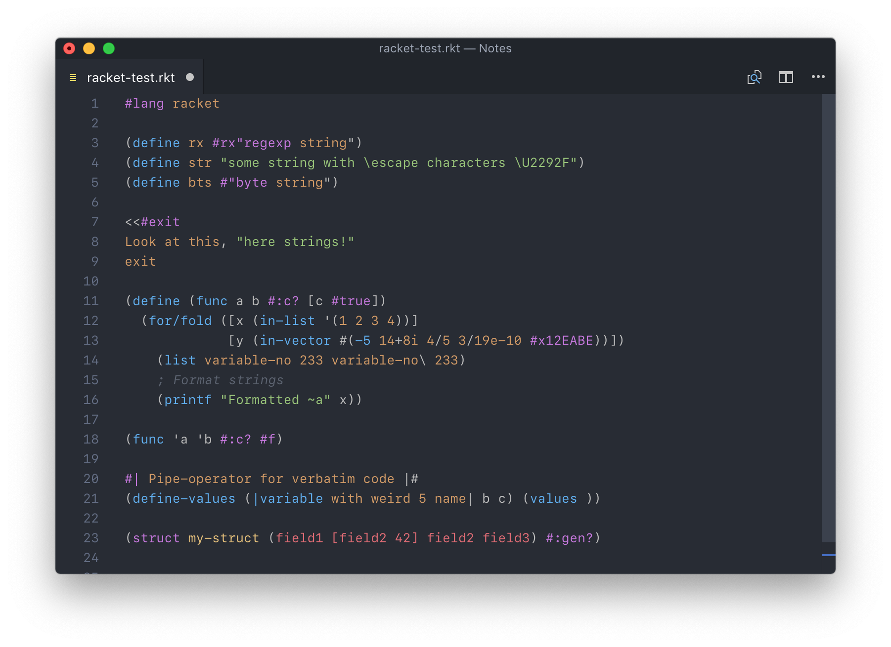
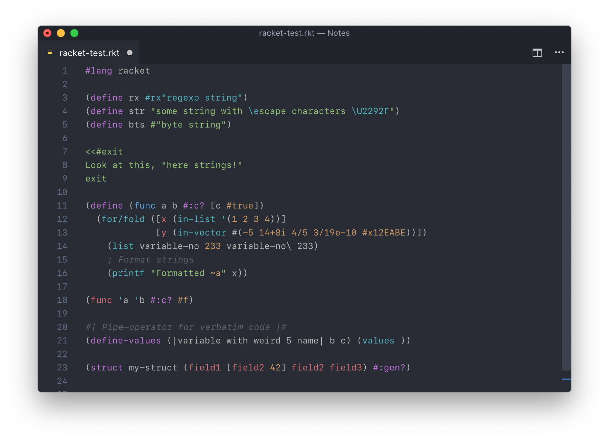

# Magic Racket for VSCode

This extension adds support for [Racket](http://www.racket-lang.org) syntax highlighting. There are already many packages that try to accomplish the same, but this one aims to:

- have nearly complete support for every valid Racket syntax, including byte strings, quotes and define clauses
- have the `#lang racket` built-in functions fully implemented
- don't get in way (no useless snippets, no colorization just for the sake of it)
- be easily convertible to other formats, which means eventually I'll be able to port this package to other editors as well

This package is being worked on; the first two points from the abovementioned three are already here, however. You can checkout the differences between Magic Racket and other packages in the next section.

## Magic Racket vs other packages

_The theme used in the screenshots is Atom One Dark. The code samples are just my gibberish._

Here is a sample file, showcasing various types of valid Racket syntax, highlighted using the package listed as first result when searching for *Racket* on the VSCode extension marketplace.

And here you can see the same snippet of code highlighted with Magic Racket.

The highlighting is not only "more colorful", it strives to be _correct_. In particular, if your number isn't getting highlighted, it's most likely due to it being wrong, and it probably won't be accepted by the Racket reader.

## Todo

This is a list of this which are not yet implemented/don't work as well as they should. It's mostly some weird syntax which I've never seen in the wild:

- [ ] sexp-comments: `;#[...]`
- [ ] boxes: `#&`
- [ ] graphs
- [ ] structs with weird names: `this| is name of the struct|`

## Contributing

If you find any issues with the highlighting, please [open an issue](https://github.com/Eugleo/magic-racket/issues) or better, submit a pull request. This project is still mostly untested and thus there will be probably many bugs at first.

If you have any feature requests or other ideas, please open an issue as well. I hope to make this package a complete Racket experience someday, so don't be afraid to discuss any ideas you have.